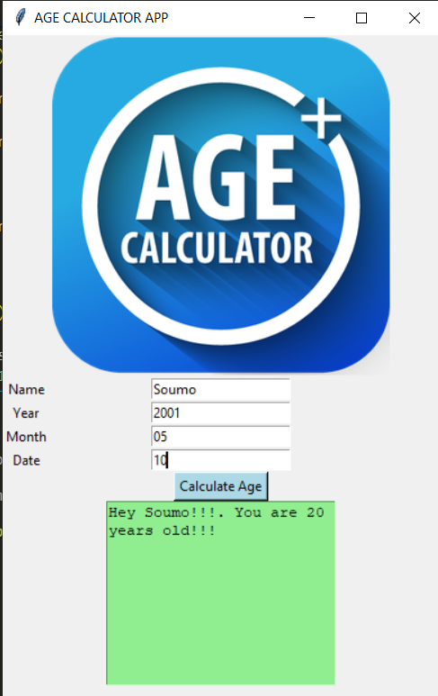

# Age-Calculator-App
<strong>Age Calculator App Using Python Tkinter</strong>

##


##

<b>First things first, we need to import 3 libraries. The first one is the obvious one, which is tkinter. Then, we need datetime library to work with dates. Finally, we need PIL library which will help us to work with images.</b>
```ruby
import datetime
import tkinter as tk
from PIL import Image,ImageTk
```
<b>Now, let’s create a window for our app and name it as ‘Age Calculator App’.</b>
```ruby
root=tk.Tk()
root.geometry("600x700")
root.title(" Age Calculator App ")
```
<b>Now, create 4 labels, each for the name, year, month, and the date and put them in the grid.</b>
```ruby
name = tk.Label(text = "Name")
name.grid(column=0,row=1)
year = tk.Label(text = "Year")
year.grid(column=0,row=2)
month = tk.Label(text = "Month")
month.grid(column=0,row=3)
date = tk.Label(text = "Day")
date.grid(column=0,row=4)
```
<b>For all the labels created, we will create corresponding entry fields in order to get the user inputs. Put them on the right side of corresponding labels using ‘grid’ method.</b>
```ruby
nameEntry = tk.Entry()
nameEntry.grid(column=1,row=1)
yearEntry = tk.Entry()
yearEntry.grid(column=1,row=2)
monthEntry = tk.Entry()
monthEntry.grid(column=1,row=3)
dateEntry = tk.Entry()
dateEntry.grid(column=1,row=4)
```
<b>Let’s define a function to get the user inputs, called getInput(). Inside that, we create an object of the ‘Person‘ class (which will be defined later) and pass the name and birth date to ‘__init__‘ method of that class.

Note that we use the predefined ‘int()’ method to convert values into integer format. Then, we create a text area that will display the age of the user as output.</b>
```ruby
def getInput():
    name=nameEntry.get()
    person = Person(name,datetime.date(int(yearEntry.get()),int(monthEntry.get()),int(dateEntry.get())))
    textArea = tk.Text(master=window,height=10,width=25)
    textArea.grid(column=1,row=6)
    answer = " Heyy {monkey}!!!. You are {age} years old!!! ".format(person=name, age=person.age())
    textArea.insert(tk.END,answer) 
```
<b>Now, we will create a button for the user to submit his/her input values. We link the button to our ‘getInput‘ function.</b>
```ruby
button=tk.Button(root,text="Calculate Age",command=getInput,bg="pink")
button.grid(column=1,row=5)
```
<b>Now, let’s define the ‘Person’ class. Define the __init__ method and also the ‘age‘ method which will calculate the age of the user by subtracting the user’s birth date from today’s date.</b>
```ruby
class Person:
    def __init__(self,name,birthdate):
        self.name = name
        self.birthdate = birthdate
    def age(self):
        today = datetime.date.today()
        age = today.year-self.birthdate.year
        return age
```
<b>Now, we are going to add an image to our app so that it will look beautiful. You have to place the image in the same folder as that of the Python file.</b>
```ruby
image=Image.open('app_image.jpeg')
image.thumbnail((300,300),Image.ANTIALIAS)
photo=ImageTk.PhotoImage(image)
label_image=tk.Label(image=photo)
label_image.grid(column=1,row=0)
```
<b>Finally, let’s run everything inside the window using ‘mainloop()’ method.</b>
```ruby
root.mainloop()
```

##

# OUTPUT


